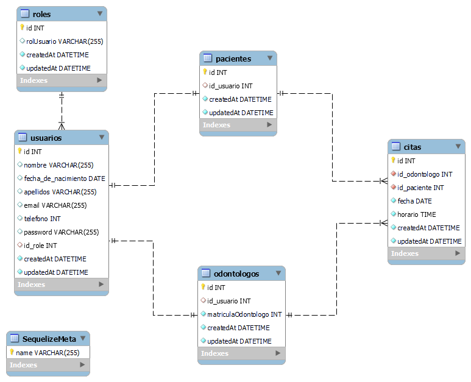

# Clinica Dental API

<details>
  <summary>Contenido 📝</summary>
  <ol>
    <li><a href="#objetivo">Objetivo</a></li>
    <li><a href="#sobre-el-proyecto">Sobre el proyecto</a></li>
    <li><a href="#stack">Stack</a></li>
    <li><a href="#diagrama-bd">Diagrama</a></li>
    <li><a href="#instalación-en-local">Instalación</a></li>
    <li><a href="#endpoints">Endpoints</a></li>
    <li><a href="#team">Team</a></li>
    <li><a href="#agradecimientos">Agradecimientos</a></li>
    <li><a href="#contacto">Contacto</a></li>
  </ol>
</details>

## Deploy
<p>Click <a href="clinicdental-production.up.railway.app">hear </a>for go to the databases in Railway</p>

## Objetivo

Realizar una API funcional conectada a una base de datos, en este caso se realizo de una Clinica Dental con al menos relaciones entre pacientes, citas y odontologos.

## Sobre el proyecto

La idea del proyecto es que los usuarios se lorgren registar, crear, modificar y eliminar, se puedan diferenciar por roles de admin y usuarios, tambien a su vez aparecen como pacientes y odontonlogoo, con restricción en la información a la que pueden acceder dependiendo de su role.

## Stack

Tecnologías utilizadas:

<div align="center">
<a href="https://sequelize.org/">
    
</a>
<a href="https://www.expressjs.com/">
    
</a>
<a href="https://nodejs.org/es/">
    
</a>
<a href="https://developer.mozilla.org/es/docs/Web/JavaScript">
    
</a>
 </div>

## Diagrama BD



## Instalación en local

1. Clonar el repositorio
2. `$ npm install`
3. Conectamos nuestro repositorio con la base de datos
4. `$ Ejecutamos las migraciones`
5. `$ Ejecutamos los seeders`
6. `$ npm run dev`
7. ...

## Endpoints

<details>
<summary>Endpoints</summary>

- AUTH

- REGISTRAR USUARIO

       POST http://localhost:3000/auth/register/

  body:

  ```js
   {

       "nombre": "Luisito",
       "apellidos": "Comunica",
       "fecha_de_nacimiento":" 2000-05-05",
       "email": "luis@luis.com",
       "telefono": "66678945",
       "password": "12345678"

   }
  ```

- LOGIN

       POST  http://localhost:3000/auth/login

  body:

  ```js
  {
      "email": "jose@correo.com",
      "password":"12345678"
  }

  ```

- USUARIO

- PERFIL DE USUARIO

        GET  http://localhost:3000/usuarios/getProfile

  body:

  ```js
  {
      "email": "jose@correo.com",
      "password":"12345678"
  }

  ```

- MODIFICAR PERFIL DE USUARIO

      PUT  http://localhost:3000/usuarios/updateprofile

  body:

  ```js
  {
      "nombre": "cesar",
      "apellidos": "Pala"
      ...
      ...
      ...
  }

  ```

- CREACION DE CITAS

       POST  http://localhost:3000/citas/createcita/

  body:

  ```js
  {
      "id_odontologo":1,
      "fecha": "2023-05-15",
      "horario": "20:00:00"
  }

  ```

- VER CITAS COMO CLIENTE

       GET  http://localhost:3000/citas/cita

- MODIFICAR CITAS

      PUT  http://localhost:3000/citas/updatecita/1

  body:

  ```js
      {
          "fecha": "2023-06-20",
          "horario": "01:00:00"
      }

  ```

- ELIMINAR CITAS

       DELETE  http://localhost:3000/citas/deletecita/1

- ODONTOLOGO

- VER CITAS COMO ODONTOLOGO

       GET  http://localhost:3000/citas/cita/odontologo/

- ADMIN

- VER TODAS LAS CITAS

       GET  http://localhost:3000/usuarios?page=1

- REGISTRAR ODONTOLOGO

       POST http://localhost:3000/auth/register/odontologo

  body:

  ```js
      {
          "nombre": "Luisito",
          "apellidos": "Nocomunica",
          "fecha_de_nacimiento":" 2000-05-05",
          "email": "luis@luis.com",
          "matriculaOdontologo":"123654789",
          "telefono": "66678945",
          "password": "12345678"
       }
  ```

  </details>

## Team:

**_Francisco Campana_**  
<a href="https://github.com/FranciscoCampana1" target="_blank"></a>

**_César Parada_**  
<a href="https://github.com/Cesarparada" target="_blank"></a>

## Agradecimientos:

Agradezco al profesor:

- **_Prof. Fidel Guilart_**

## Contacto

**_César Parada_**  
<a href="https://github.com/Cesarparada" target="_blank"></a>

<a href="mailto:cesard.0925@gmail.com"></a>

<a href="https://www.linkedin.com/in/linkedinUser/" target="_blank"></a>

</p>
